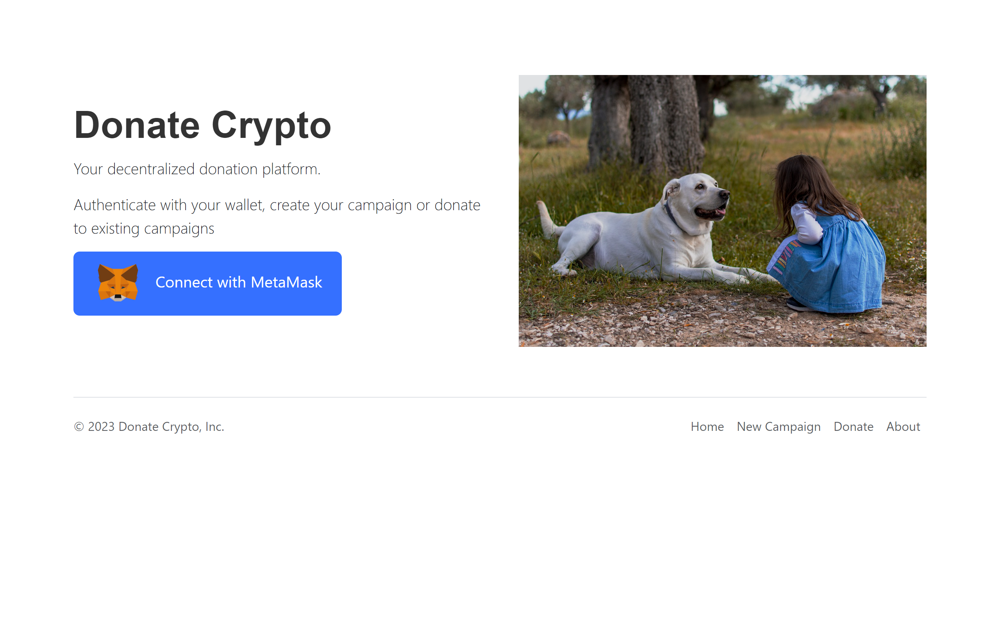
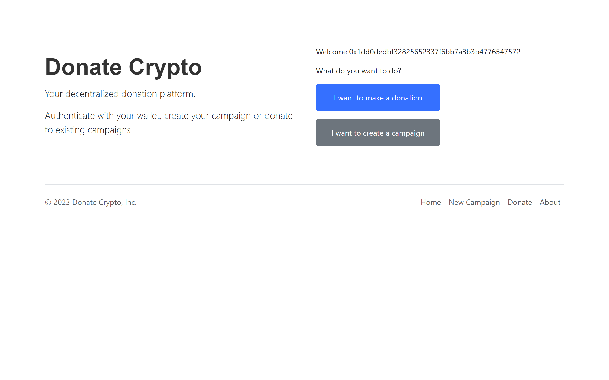
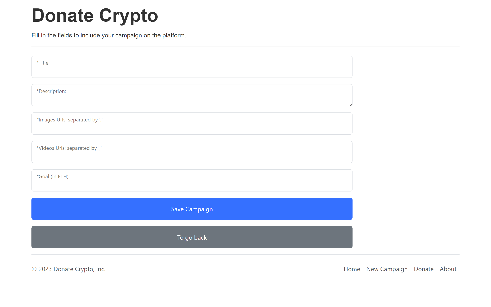
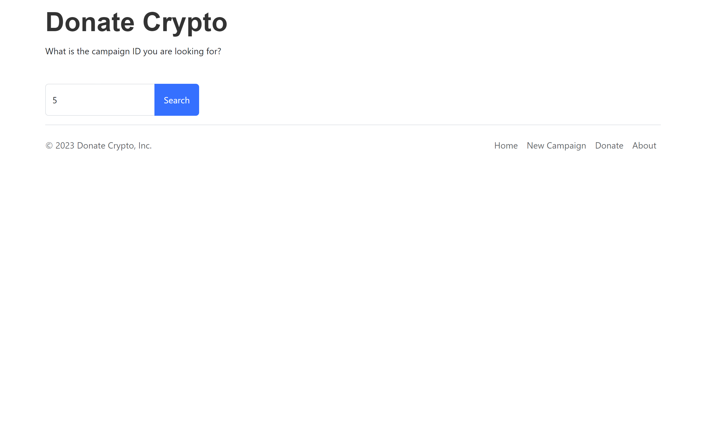

# DonateCrypto

A Dapp of voluntary campaign, you can create a new campaign with a goal, or make donations to an existent campaign.

## Softwares

- [React.ts](https://pt-br.legacy.reactjs.org/)
- [Solidity](https://soliditylang.org/)
- [Hardhat.ts](https://hardhat.org/)

## Contracts

Deployed in Sepolia network.

- DonateCrypto.sol
Address: 0xcc46445101cCBeb56b7760C61ccA110b71A177c4

https://sepolia.etherscan.io/address/0xcc46445101cCBeb56b7760C61ccA110b71A177c4#code
- DonateCryptoAdapter.sol

Address: 0xeceC29332180e3a3E9D4aBd9dc82C28A1c453e1f
https://sepolia.etherscan.io/address/0xeceC29332180e3a3E9D4aBd9dc82C28A1c453e1f#code

## Author

- Allex Antoniollo

## Screenshots

